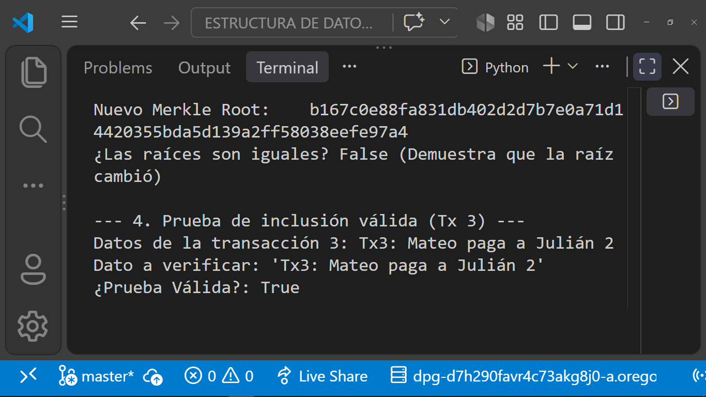
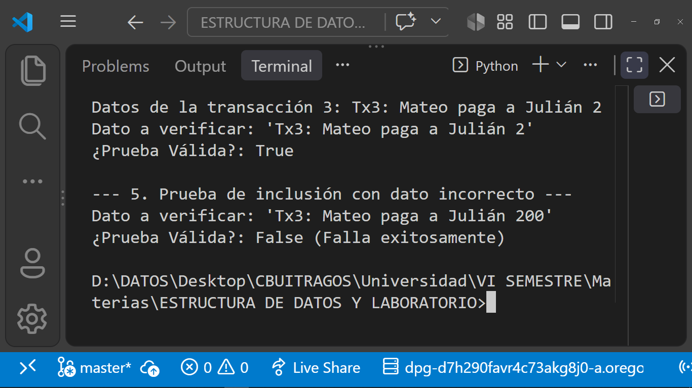

# Laboratorio 2: Implementación de Árbol de Merkle (Merkle Tree)

## Descripción del Proyecto
Este proyecto implementa una estructura de datos de Árbol de Merkle en Python utilizando el algoritmo de resumen criptográfico **SHA-256**. Su objetivo es demostrar cómo se asegura la inmutabilidad de un conjunto de datos y cómo se generan y verifican las pruebas de inclusión (*Merkle Proofs*) de manera eficiente.


---

## Diagrama del Árbol Construido (5 Transacciones)

Debido a que el experimento utiliza 5 transacciones (número impar), el algoritmo duplica el último elemento en los niveles que lo requieren para permitir el emparejamiento de nodos:

```
                                  [ Merkle Root ]
                                 /               \
                                /                 \
                       [ Hash 0123 ]           [ Hash 4444 ]
                      /             \                |
                     /               \               |
              [ Hash 01 ]        [ Hash 23 ]    [ Hash 44 ]
             /          \       /          \         |
            /            \     /            \        |
        [H0]             [H1] [H2]          [H3]    [H4]  [H4 (Copia)]
         |                |    |             |       |        |
        Tx1              Tx2  Tx3           Tx4     Tx5      Tx5
```

---

## Ejecución del Proyecto
Para ejecutar la prueba y verificar el comportamiento del código:

```bash
python main.py
```

---

## Evidencias de Verificación (Capturas de Pantalla)

### 1. Prueba de Inclusión Válida
Se verifica que la **Transacción 3** (`Tx3: Mateo paga a Julián 2`) pertenece legítimamente al árbol generando su hash a partir del camino de la prueba:



### 2. Prueba de Inclusión Inválida (Dato Incorrecto)
Se intenta validar un dato alterado (`Tx3: Mateo paga a Julián 200`) usando la prueba de inclusión. El sistema detecta la inconsistencia y rechaza la validación:



---

## Declaración sobre el uso de Inteligencia Artificial Generativa

En cumplimiento con las políticas de la asignatura sobre el uso de herramientas de IA:

* **Herramientas utilizadas:** IA Generativa (Modelo Gemini).
* **Alcance de la herramienta:** Se utilizó la IA como apoyo para la estructuración de las funciones de la clase `MerkleTree`, la generación del algoritmo de cálculo del árbol de forma iterativa, la formulación lógica de las pruebas de inclusión (`get_proof` y `verify_proof`) y la redacción del archivo readme.
* **Responsabilidad y Autoría:** Se dio cumplimiento a la revisión, depuración y pruebas de ejecución del código. Se tiene por comprendida en su totalidad la lógica criptográfica y el flujo de ejecución de este laboratorio.